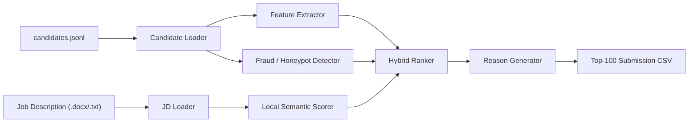

# Recruitment Engine

AI-assisted candidate discovery for the Redrob Intelligent Candidate Discovery challenge.

This repo ranks 100,000 candidate profiles for a Senior AI Engineer role using a local, reproducible ranking pipeline. The system is built to behave more like a careful recruiter than a keyword filter: it reads the job description, extracts evidence from career history and platform behavior, rejects obvious traps, and produces a trusted top-100 shortlist.

## Why This Exists

Recruiting search often fails because the best candidates do not always write the exact keywords in the job description, while weak candidates can stuff their profiles with fashionable terms. This project attacks that gap directly:

- career history matters more than keyword density
- shipped production systems matter more than tutorials
- availability and recruiter response matter
- suspicious profiles and honeypots are penalized
- ranking runs locally with no hosted LLM or hosted vector database dependency

## What It Produces

The pipeline writes a valid submission CSV:

```text
candidate_id,rank,score,reasoning
CAND_0071974,1,0.908890,"7.8yr Senior AI Engineer; 7.7yr applied ML evidence; strong shipped retrieval/ranking-system evidence; ..."
```

The generated file lives at:

```bash
output/submission.csv
```

`output/` is intentionally ignored by Git so generated artifacts do not pollute the source repo.

## Architecture



## Ranking Signals

The final score combines local semantic similarity with structured recruiter-style evidence:

| Signal | What it captures |
| --- | --- |
| Skill capability buckets | Retrieval, vector search, ranking/eval, Python/ML, LLM/NLP, production ML |
| Career relevance | Role titles, past roles, seniority, applied ML career depth |
| Shipped-system evidence | Production search, ranking, recommendation, retrieval, evaluation, deployment |
| Applied ML years | Years of credible ML/AI work from career history, not just profile summary |
| Behavioral availability | Recency, response rate, response speed, open-to-work, recruiter saves |
| Logistics | Location, relocation fit, notice period |
| Fraud / honeypot checks | Impossible timelines, keyword stuffing, expert skills with zero usage, stale profiles |

## Why It Is Reproducible

The default path is CPU-only and local:

- no hosted vector database required
- no hosted LLM required
- no GPU required
- no network calls during ranking
- deterministic ranking tie-breaks
- official CSV validator passes

Hosted LLM explanations are optional only. The submitted ranking path does not call hosted APIs; semantic scoring uses local TF-IDF by default or local sentence-transformer embeddings when requested.

## Project Layout

```text
.
├── config.py                    # Environment-driven config and scoring weights
├── run_pipeline.py              # Main CLI entrypoint
├── pipeline/
│   ├── jd_loader.py             # Reads JD files
│   ├── loader.py                # Candidate JSON/JSONL loading helpers
│   ├── embedder.py              # Local TF-IDF / optional local embedding scoring
│   ├── evidence.py              # Recruiter-style evidence extraction
│   ├── feature_extractor.py     # Structured candidate feature extraction
│   ├── fraud_detector.py        # Honeypot and suspicious-profile checks
│   ├── ranker.py                # Hybrid score calculation
│   ├── explainer.py             # Submission reasoning text
│   └── graph_rag.py             # Experimental graph expansion, disabled by default
├── requirements.txt
├── .env.example
└── README.md
```

## Setup

```bash
python3 -m venv .venv
source .venv/bin/activate
pip install -r requirements.txt
```

Optional path overrides:

```bash
cp .env.example .env
```

Edit `.env` if your dataset is not in the default location.

## Run A Smoke Test

```bash
python3 run_pipeline.py \
  --sample \
  --top-k 50 \
  --output-csv output/sample_submission.csv
```

The official sample has only 50 candidates, so this smoke-test output is not expected to pass the 100-row validator.

## Run The Full Pipeline

```bash
python3 run_pipeline.py \
  --candidates-file "/path/to/candidates.jsonl" \
  --jd-file "/path/to/job_description.docx" \
  --output-csv output/submission.csv
```

Validate with the official script:

```bash
python3 /path/to/validate_submission.py output/submission.csv
```

Current local benchmark on the provided 100k dataset:

```text
Runtime: 156.7 seconds
Filtered suspicious profiles: 4,182
Output rows: 100
Validator: Submission is valid.
```

## Useful Options

```bash
python3 run_pipeline.py --help
```

Important flags:

- `--sample`: run on `sample_candidates.json`
- `--semantic-backend tfidf`: default local semantic scorer
- `--semantic-backend embedding`: optional local sentence-transformer scoring
- `--semantic-backend none`: structured-feature-only scoring
- `--use-graph`: experimental graph boost, disabled by default

## Design Notes

The scoring intentionally favors proof over claims. A candidate who says "RAG" in a summary gets less credit than a candidate whose career history shows they shipped search, ranking, recommendation, or retrieval systems. Non-technical profiles with AI-learning language are heavily down-weighted, because the JD explicitly warns against keyword stuffing and recent tutorial-only AI exposure.

The reason column is generated locally from structured evidence. It is designed for recruiter review, not marketing copy.

## Submission Checklist

- [x] Full pipeline runs locally
- [x] No hard-coded API keys
- [x] No hosted API dependency in default ranking path
- [x] Output matches `candidate_id,rank,score,reasoning`
- [x] Official validator passes
- [ ] Fill `submission_metadata_template.yaml`
- [ ] Build final deck/PDF

## Ethics And Tooling

This repository contains original challenge-specific code. AI assistance was used during development and should be disclosed honestly in the challenge metadata if required. The implementation is intentionally transparent so every ranking decision can be explained and defended.
